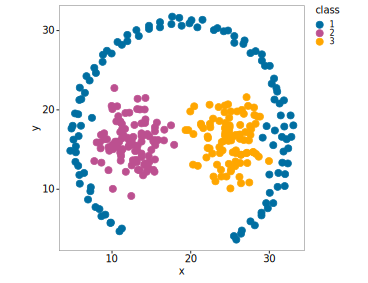
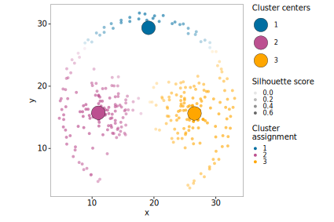

### Clustering approaches to capture known clusters in a path based data set

In this project, we will be using three different clustering approaches in an attempt to capture three known clusters in the below 2-dimensional dataset:



We will be using:
* K-means clustering
* Expectation Maximization (EM) clustering (Gaussian Mixture Models)
* Density-Based Spatial Clustering of Applications with Noise (DBSCAN)

We will discover that both k-means and EM-clustering are not able to capture the known clusters of the data set, while DBSCAN comes close. In addition, we will play around with the structure of the dataset to discover what prevents DBSCAN from achieving the perfect desired result.

While clustering is an unsupervised approach meant to identify distinct groups in data without labels, here we test different algorithms’ ability to capture already known, visually distinct clusters of arbitrary sizes (two spherical clusters and one crescent shape). This is not the typical use case for clustering, but rather a learning aid.

## K-means clustering
K-means is one of the most widely used clustering methods, known for its simplicity and efficiency. It partitions data by minimizing the variance within clusters, which leads to spherical clusters of roughly equal size and density.

We can estimate the optimal number of clusters using the silhouette score:

```r
set.seed(123)

#Create function to retrieve average silhouette score
silhouette_score <- function(k){
  km <- kmeans(df, centers = k, algorithm = "Lloyd", iter.max = 100, nstart=25)
  ss <- cluster::silhouette(km$cluster, dist(df))
  mean(ss[, 3])
}

#Number of k to iterate over
k <- 2:10

#Apply silhouette score function to every element of k
avg_sil <- purrr::map_vec(k, silhouette_score)

#Plot
plot(k, type='b', avg_sil, xlab='Number of clusters', ylab='Average Silhouette Scores', frame=FALSE)
```


K-means clustering suggests the presence of three distinct clusters as the best description of the dataset. 

We run the model with three clusters, and visualize the cluster assignments and silhouette scores:

```r
set.seed(123)

#df is our dataset
kmeans_result <- kmeans(df, centers = 3)

#New dataframe with results and true classifications
df_k_means_comparison <- df_with_classes %>% 
  dplyr::mutate(k_means = as.factor(kmeans_result$cluster)) %>% 
  dplyr::mutate(silhouette = cluster::silhouette(kmeans_result$cluster, dist(df))[,3]) %>% 
  dplyr::mutate(classification = ifelse(class == k_means, "Correct", "Incorrect"))

#Show with centers and silhouette scores
ggplot(df_k_means_comparison, aes(x = x, y = y))+
  geom_point(aes(color = k_means, alpha = silhouette), shape = 16)+
  geom_point(data = kmeans_result$centers, 
             aes(x = x, y = y, 
                 fill = row.names(kmeans_result$centers)),
             size = 8,
             shape = 21,
             stroke = 0.25)+
  scale_color_manual(values = class_colors,
                     name = "Cluster\nassignment")+
  scale_fill_manual(values = class_colors,
                    name = "Cluster centers")+
  scale_alpha(
    range = c(0.1, 0.7),
    guide = guide_legend(nrow = 1),
    name = "Silhouette score")+
  guides(alpha = guide_legend(
    override.aes = list(color = "black", fill = "white")))
```



K-means captures the two spherical clusters quite well, but it fails on the crescent shape, splitting it across clusters. This illustrates a key limitation: k-means implicitly favors spherical partitions, and struggles with elongated or non-convex shapes.

## EM-clustering

Expectation Maximization clustering, as implemented in Mclust package, fits a mixture of Gaussian distributions. This allows clusters to be elliptical and tilted, offering more flexibility than k-means. 

The optimal number of clusters is again estimated via silhouette scores:

```r
em_long_results <- list()
for (k in 2:10){ 
  
  em_model <- mclust::Mclust(df, G = k)
  
  df_temp <- tibble(
    id = 1:nrow(df),
    true_class = as.factor(classes),
    k = rep(k, nrow(df)),
    silhouette = silhouette(em_model$classification, dist(df))[,3],
    classification = as.factor(em_model$classification))
    
    em_long_results[[as.character(k)]] <- df_temp
}

#Combine em results
em_results <- dplyr::bind_rows(em_long_results) %>% 
  dplyr::group_by(k) %>% 
  dplyr::summarize(silhouette = mean(silhouette), .groups = "drop")

#Plot
plot(2:10, em_results$silhouette, type='b', xlab='Number of clusters', ylab='Average Silhouette Scores', frame=FALSE)
```


Much like k-means, EM-clustering suggests that three distinct clusters is the optimal number for the given data set. 

Re-running with three clusters:

```r
#Re run model with the optimal cluster number
em_model <- Mclust(df, G = 3) 

#Compute silhouette scores
em_results_k3 <- data.frame(x = df$x,
                            y = df$y,
                            classification = as.factor(em_model$classification),
                            silhouette = cluster::silhouette(em_model$classification, dist(df))[,3])

#Extract cluster centers for plotting
cluster_centers <- t(em_model$parameters$mean) %>% 
  as.data.frame() %>% 
  tibble::rowid_to_column("classification") %>% 
  dplyr::mutate(classification = factor(classification))

em_results_k3 %>%
  ggplot(aes(x = x, y = y))+
  geom_point(aes(color = classification, alpha = silhouette), shape = 16)+
  geom_point(data = cluster_centers, 
             aes(x = x, y = y, 
                 fill = classification),
             size = 8,
             shape = 21,
             stroke = 0.25)+
  scale_color_manual(values = class_colors,
                     name = "Cluster\nassignment")+
  scale_fill_manual(values = class_colors,
                    name = "Cluster centers")+
  scale_alpha(
    range = c(0.1, 0.7),
    guide = guide_legend(nrow = 1),
    name = "Silhouette score")+
  guides(alpha = guide_legend(
    override.aes = list(color = "black", fill = "white")))
```


Although EM/GMMs can produce elliptical clusters, here they perform nearly identically to k-means. The reason: EM is still constrained by the Gaussian assumption — so while ellipses and tilts are possible, non-Gaussian shapes like crescents cannot be modeled well. 

## DBSCAN
DBSCAN differs fundamentally: instead of partitioning by distance, it groups data points by local density. A point is considered part of a cluster if it has enough neighbors within a given radius (eps). This makes DBSCAN able to detect:

* Arbitrary cluster shapes (not just spheres/ellipses),
* Noise points (outliers not belonging to any cluster).

A slight complexity is that DBSCAN requires tuning of two key parameters:
* `eps`: neighborhood radius
* `minPts`: minimum neighbors to form a core point

Unlike k-means or EM, DBSCAN doesn’t require specifying the number of clusters — but the results are sensitive to these parameters.

For DBSCAN we will use the dbscan R package and we will perform a grid search with a double for loop:

```r
set.seed(123)

#Perform grid search
dbscan_plot_list <- list()

for (minPts in 3:8){
  
  for (eps in seq(1.5, 2, by = 0.1)){
    
    db_result <- dbscan::dbscan(df, eps = eps, minPts = minPts)
    
    #Collect desired outputs from model
    db_results <- data.frame(x = df$x,
                            y = df$y,
                            classification = as.factor(db_result$cluster))
    
    #Plot
    circle_legend <- data.frame(
      x = mean(range(df$x)),     #horizontally centered
      y = min(df$y) - 1,         #a bit below the bottom
      r = eps                    #set to current eps value
    )
    
    plot <- db_results %>%
      ggplot(aes(x = x, y = y))+
      geom_point(aes(color = classification), shape = 16)+
      scale_color_manual(values = class_colors,
                         labels = c(`0` = "Noise"),
                         name = "Cluster\nassignment")+
      labs(title = paste0("eps = ", eps, ", minPts = ", minPts))+
      ggforce::geom_circle(data = circle_legend,
                       aes(x0 = x, y0 = y, r = r),
                       color = "black", linetype = "dashed",
                       linewidth = 0.25)
    
    dbscan_plot_list[[paste0("eps_", eps, "_minPts_", minPts)]] <- plot
    
    ggsave(plot = plot, here::here(paste0('data/figures/DBSCAN/eps_', eps, "_minPts_", minPts,'.svg')), width = 100, height = 75, units = "mm")
    
  }
}
```

The above code produces a plot for every combination of `minPts` and `eps`, but for simplicities sake I have highlighted a few examples here (the dashed circle represents the selected `eps` radius):


When `minPts` is too small, the whole data set will be recognized as one cluster (a). When `minPts` is too large, the two central clusters are correctly identified, but the crescent shape is identified as several distinct clusters because the density is too low in some places along the arc (notice how there is a "break" in the density at the top of the arc, which prevents identification of a single cluster in all plots).

Setting `minPts` to three and `eps` to 1.9 produces the clustering which is most accurate to the 'true' clusters (c). The problem here is once **again the break in density at the crest**, but also the fact that **the right spherical cluster and crest are not separated by a change in density**.

Notice how a very small change in `eps` has produced very different clustering results (compare panel a and c, where `eps` is 2 and 1.9, respectively), highlighting the importance of fine tuning these hyperparameters.

## Manipulating the dataset for DBSCAN

To visualize the importance of the densities in our dataset for DBSCAN, we can manipulate the dataset.

Recall how we identified two factors preventing DBSCAN to identify the crescent shape and two spherical clusters separately:
* Too low density in the crescent shape
* Lack of change in density between right most spherical cluster and crescent shape

Let's try, for learnings sake, to remove these factors by increasing the density of the crescent shape and removing a few data points between the right most spherical cluster and the crescent shape.

```r
set.seed(123)

#Add jitter to existing class 1 points
cluster_1_points <- df_with_classes %>%
  dplyr::filter(class == 1) %>%
  sample_n(200, replace = TRUE) %>% #draw 200 random data points from class 1 samples
  dplyr::mutate(
    x = x + rnorm(n(), mean = 0, sd = 0.2),
    y = y + rnorm(n(), mean = 0, sd = 0.2)
  )

#Bind to original df
df_dense <- dplyr::bind_rows(df_with_classes, cluster_1_points)

#Remove points between crescent and right most cluster
df_dense_filtered <- df_dense %>%
  filter(!(x >= 28 & x <= 31 & y >= 11 & y <= 19))
```

Let's compare the structure and density of the original data set (top row in below plot) and our newly modified dataset:


Notice in panel c how there are data points missing between the right most spherical cluster and the crescent shape so that there is now a clear separation in density. 

Likewise, on the density plots in panels b and d, notice how the crescent shape is now more dense than before.

We can re run or grid search DBSCAN on the modified data set. Below are some select examples:


With the modified data set, DBSCAN is now able to identify the crescent shape (panel d) and in addition separate the two spherical clusters. 

# Summary
* K-means and EM work well for spherical/elliptical clusters but break down on non-convex shapes
* DBSCAN handles arbitrary shapes and noise but struggles with density variation
* Knowing the assumptions of the algorithm and (in some cases) tuning of hyperparameters is key
